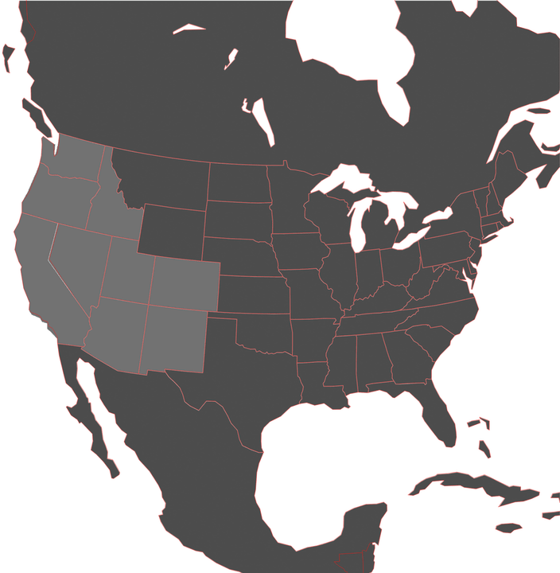

# ATS Coordinate Reference System

In late 2024, **[@truckermudgeon](https://github.com/truckermudgeon)**
discovered that the ATS `map_factor` needs to be multiplied with the length
of a degree in order to obtain the scale denominator. Using that discovery,
this script transforms some real-life spatial data into the ATS coordinate
system and draws it on top of a map texture used in the ATS UI. This can
be used to judge whether the CRS used for the transformation is described
correctly.

[The result](https://nautofon.github.io/scs-crs/ne_ats.svg) looks more than
satisfactory:

<a href="https://nautofon.github.io/scs-crs/ne_ats.svg"></a>
<!-- GH uses CORS headers to prevent the loading of map.png from within
the SVG, hence we can't use the SVG to preview itself -->

red = real-life data, transformed by this script  
grey = ATS map texture

## Input Data

The UI map texture `map.png` used in ATS was originally made using
[Natural Earth](https://www.naturalearthdata.com) data (1:100 million).
The `ne_ats.geojson` file was created more or less like this:

```sh
curl -LSs \
  -O https://naciscdn.org/naturalearth/110m/cultural/ne_110m_admin_0_boundary_lines_land.zip \
  -O https://naciscdn.org/naturalearth/110m/cultural/ne_110m_admin_1_states_provinces_lines.zip \
  -O https://naciscdn.org/naturalearth/110m/physical/ne_110m_coastline.zip \
  -O https://naciscdn.org/naturalearth/110m/physical/ne_110m_lakes.zip

qgis_process run native:difference --ellipsoid=EPSG:7030 \
  --INPUT=ne_110m_admin_0_boundary_lines_land.zip \
  --OVERLAY='ne_110m_lakes.zip' \
  --OUTPUT=ne_ats_boundary_lines_land_no_lakes.gpkg

qgis_process run native:extractbyexpression --ellipsoid=EPSG:7030 --area_units=deg \
  --INPUT=ne_110m_lakes.zip \
  --EXPRESSION='$area > .4' \
  --OUTPUT=ne_ats_large_lakes.gpkg

qgis_process run native:polygonstolines \
  --INPUT=ne_ats_large_lakes.gpkg \
  --OUTPUT=ne_ats_large_lakes_shore_lines.gpkg

qgis_process run native:mergevectorlayers \
  --LAYERS=ne_110m_admin_1_states_provinces_lines.zip \
  --LAYERS=ne_110m_coastline.zip \
  --LAYERS=ne_ats_boundary_lines_land_no_lakes.gpkg \
  --LAYERS=ne_ats_large_lakes_shore_lines.gpkg \
  --OUTPUT=ne_ats_merged.gpkg

qgis_process run native:retainfields \
  --INPUT=ne_ats_merged.gpkg \
  --FIELDS=featurecla \
  --OUTPUT=ne_ats_noattrs.gpkg

qgis_process run native:extractbyextent --ellipsoid=EPSG:7030 \
  --INPUT=ne_ats_noattrs.gpkg \
  --EXTENT='-133.8,-56.8,16.21,61.8 [EPSG:4326]' --CLIP=true \
  --OUTPUT=ne_ats.gpkg

# The NE data has some minor issues near New Jersey and Michigan
# that can be fixed manually in ne_ats.gpkg if desired.

ogr2ogr -xyRes 1e-4 ne_ats.geojson ne_ats.gpkg
```

## Prerequisites

[Perl](https://www.perl.org/) v5.20 or later (see also [Perlbrew](https://perlbrew.pl/)).

Installing the required CPAN modules can for example be done like this:

```sh
cpanm --local-lib cpan --prompt --skip-satisfied --installdeps .
```

## License

Created 2024-2025 by nautofon. I release my own work on this into the
Public Domain under the terms of [CC0](https://creativecommons.org/public-domain/cc0/).

`map.png` was extracted from [ATS](https://americantrucksimulator.com/),
© 2020 SCS Software s.r.o.
